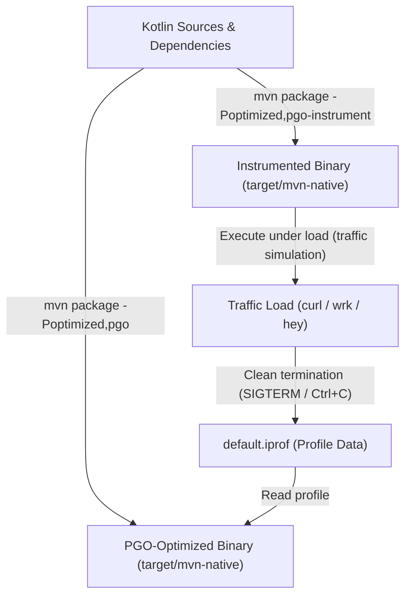

# Profile-Guided Optimization (PGO) Guide

This guide explains how to use **Profile-Guided Optimization (PGO)** with **Oracle GraalVM 25** and **Apache Maven** to maximize the runtime performance and throughput of this Kotlin http4k native application.

---

## 1. What is Profile-Guided Optimization (PGO)?

By default, GraalVM Native Image uses **ML-inferred PGO**, where machine learning models estimate branch probabilities and inlining heuristics. 

**True PGO** uses real runtime profiling data collected during actual application execution. With real profiling data, GraalVM's ahead-of-time (AOT) compiler can:
* **Inline Hot Execution Paths**: Focus inlining budgets on functions executing frequently under load.
* **Optimize Code Layout**: Colocate hot basic blocks and instructions in memory to maximize CPU L1/L2 cache hits.
* **Precise Branch Prediction**: Reorganize conditional branches based on observed real-world probabilities.
* **De-prioritize Cold Code**: Keep error handling and initialization routines outside critical execution loops.
* **Performance Gain**: Typically yields **20% to 40% higher peak throughput** and reduced memory usage compared to default builds.

---

## 2. PGO Lifecycle Workflow

PGO is a two-stage compilation process:



---

## 3. Maven Configuration

The following profiles are configured in [`pom.xml`](pom.xml):

```xml
<profiles>
    <!-- Optimized release baseline -->
    <profile>
        <id>optimized</id>
        <build>
            <plugins>
                <plugin>
                    <groupId>org.graalvm.buildtools</groupId>
                    <artifactId>native-maven-plugin</artifactId>
                    <configuration>
                        <buildArgs combine.children="append">
                            <buildArg>--future-defaults=all</buildArg>
                            <buildArg>-march=native</buildArg>
                            <buildArg>-R:MaxHeapSize=64m</buildArg>
                        </buildArgs>
                    </configuration>
                </plugin>
            </plugins>
        </build>
    </profile>

    <!-- Stage 1: Build instrumented binary -->
    <profile>
        <id>pgo-instrument</id>
        <build>
            <plugins>
                <plugin>
                    <groupId>org.graalvm.buildtools</groupId>
                    <artifactId>native-maven-plugin</artifactId>
                    <configuration>
                        <buildArgs combine.children="append">
                            <buildArg>--pgo-instrument</buildArg>
                        </buildArgs>
                    </configuration>
                </plugin>
            </plugins>
        </build>
    </profile>

    <!-- Stage 2: Build final PGO binary using default.iprof -->
    <profile>
        <id>pgo</id>
        <build>
            <plugins>
                <plugin>
                    <groupId>org.graalvm.buildtools</groupId>
                    <artifactId>native-maven-plugin</artifactId>
                    <configuration>
                        <buildArgs combine.children="append">
                            <buildArg>--pgo</buildArg>
                        </buildArgs>
                    </configuration>
                </plugin>
            </plugins>
        </build>
    </profile>
</profiles>
```

---

## 4. Step-by-Step Instructions

### Step 1: Build the Instrumented Native Binary

Compile the application with profiling instrumentation enabled:

```bash
JAVA_HOME=/home/atom/_java_/graalvm25 PATH=/home/atom/_java_/graalvm25/bin:$PATH mvn clean package -Poptimized,pgo-instrument
```

---

### Step 2: Run and Exercise the Workload

Launch the instrumented binary and send realistic traffic against the endpoints:

```bash
# 1. Start the instrumented application in background
./target/mvn-native &
APP_PID=$!

# 2. Wait for startup
sleep 2

# 3. Simulate realistic user workload
for i in {1..200}; do
  curl -s http://localhost:7070/ > /dev/null
  curl -s http://localhost:7070/greeting > /dev/null
done

# 4. Cleanly stop the application to flush profiling data
kill $APP_PID
wait $APP_PID 2>/dev/null
```

> [!IMPORTANT]
> The instrumented binary writes `default.iprof` upon **process exit**. Ensure the process is stopped cleanly (using `SIGINT` or `SIGTERM` / `Ctrl+C`). Do not use `kill -9` (`SIGKILL`), as that prevents the JVM shutdown hooks from saving the file.

Verify that `default.iprof` has been created in your project directory:
```bash
ls -lh default.iprof
```

---

### Step 3: Build the PGO-Optimized Binary

Rebuild the application using the profile data gathered in `default.iprof`:

```bash
JAVA_HOME=/home/atom/_java_/graalvm25 PATH=/home/atom/_java_/graalvm25/bin:$PATH mvn clean package -Poptimized,pgo
```

---

## 5. Verifying PGO in Build Logs

When GraalVM builds with PGO enabled, inspect the compiler summary in the build output:

* **Before (Without PGO)**:
  ```text
  Graal compiler: optimization level: 2, target machine: native, PGO: ML-inferred
  ```

* **After (With PGO)**:
  ```text
  Graal compiler: optimization level: 2, target machine: native, PGO: user-provided
  ```

The presence of `PGO: user-provided` confirms that the native image compiler successfully consumed `default.iprof` and applied optimizations tailored to your application's hot paths.

---

## 6. All-in-One Automation Script

You can copy and run this script to execute the complete PGO cycle automatically:

```bash
#!/usr/bin/env bash
set -e

export JAVA_HOME=/home/atom/_java_/graalvm25
export PATH=$JAVA_HOME/bin:$PATH

echo "=== Stage 1: Building instrumented binary ==="
mvn clean package -Poptimized,pgo-instrument

echo "=== Stage 2: Collecting profiling data ==="
./target/mvn-native &
PID=$!
sleep 2

echo "Generating load..."
for i in {1..200}; do
  curl -s http://localhost:7070/ > /dev/null
  curl -s http://localhost:7070/greeting > /dev/null
done

echo "Stopping application..."
kill $PID
wait $PID 2>/dev/null || true

if [ ! -f "default.iprof" ]; then
  echo "Error: default.iprof was not generated!"
  exit 1
fi
echo "Profiling data saved: $(ls -lh default.iprof)"

echo "=== Stage 3: Building final PGO-optimized binary ==="
mvn clean package -Poptimized,pgo

echo "=== Done! Optimized binary ready at target/mvn-native ==="
```
